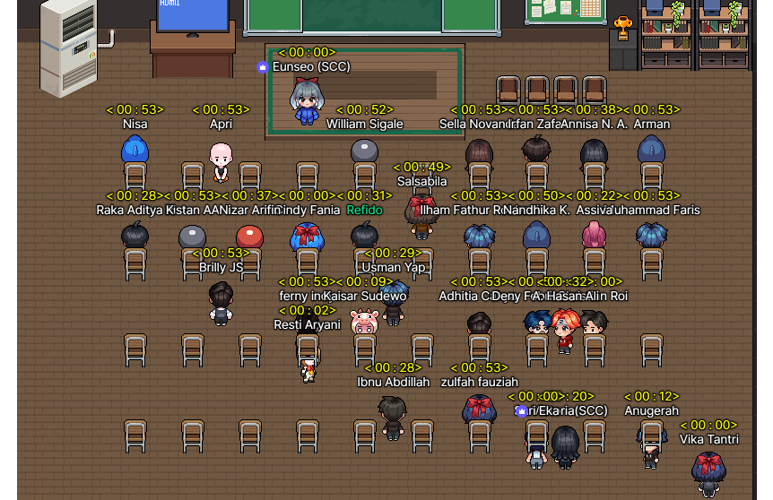

# today-i-learn

A collection of concise write-ups on small things I learn day to day.

---

## Day 1 (17 october 2022)

- Experiences

That day, I discovered [zep](https://zep.us/), a website for socializing known as the metaverse. Following that, we divided into groups and decided on the topic of our project. The experience that day was fascinating because there was so much to learn.

- Team project topic

Our group decided on warehousing, which includes deciding what items to include and then being able to add and subtract stock items.

- What I have done so far

  1. brainstorm to choose a topic with the team
  2. learn to make wireframes using Figma

- My goal in this Bootcamp

I want to build my empire...of course, in [zep](https://zep.us/).
